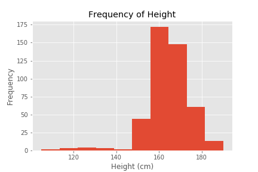
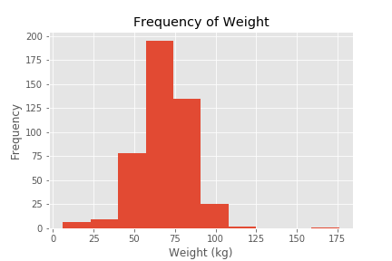
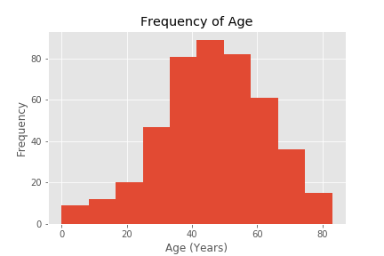
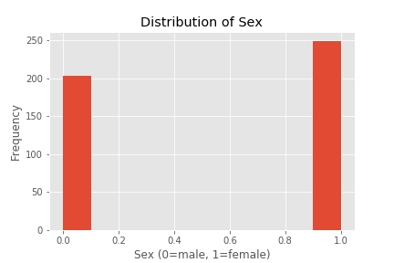
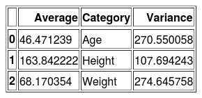
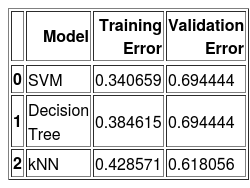
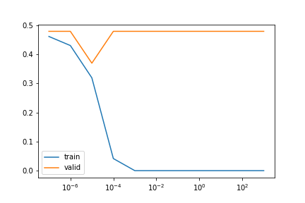
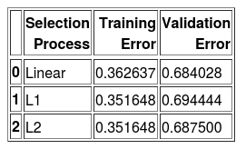
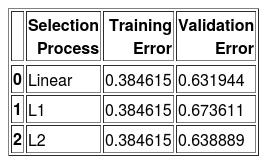

## Cardiac Arrhythmia: Feature Selection

#### Overview

In this miniature project, I explored the classification of cardiac arrhythmia
over the influence of 279 different factors. The data, pulled from the [UCI
Machine Learning Repository](http://archive.ics.uci.edu/ml/datasets/Arrhythmia),
contained 16 different classifications and 452 individual records.

This report will provide a walkthrough of the feature and model selection
process from data import to final selection.

#### Data Import

The data was first imported from a .csv from the [UCI Machine Learning
Repository](http://archive.ics.uci.edu/ml/machine-learning-databases/arrhythmia/arrhythmia.data)
in the data_import.ipynb workbook. From that point, the labels were created
using `for` loops for each of the channels of heart rhythym waves, recored for
both width and amplitude. The dataset was then exported to data/raw/raw.csv in
comma-delimited format.

#### Data Wrangling

The raw imported data was brought into the data_wrangling.ipynb workbook for
processing. In the data description, any unknown values were encoded as "?".
Further analysis found that there were 408 missing entries across 5 columns: T,
P, QRST, J, and heart_rate. The J column was made up of 83% of unknown data, so
the column was dropped. The rest of the missing data made up a maximum of 5% of
the data in the column.  Since the remaining columns were all conmtinuous, the
means were imputed.

An additional area of wrangling included taking outliers from the height column.
There existed values where heights were <600 centimeters, an obvious error.
These rows were dropped. there was no similar pattern in the weight column.

This wrangled data was then exported to data/processed/wrangled.csv in
comma-delimited format.

#### Data Analysis

The data analysis consisted of getting a feel for the data set. For the first few features (height, weight, age, sex), I plotted histograms:

Afterwards, I made a data table of summary stats for the continuous and discrete variales of those features containing their respective means and variances:

Based off of the exporatoy data analysis alone, I cannot rule out any features.

#### Data Feature and Model Selection

During the feature and model selection, I fit three classification models without feature selection: SVM, Decicion Tree, and k-Nearest Neighbors using 10-fold cross-validation. Here is a data table of those fits:

We can see that the SVM model performed the best and the k-Nearest Neighbors model performed the worst. Below is an example of how we find our optimal hyperparameters for an SVM:

Since we have not rules out any features yet, the next step is to run RFE (a type of backwards selection) through three different regression models. these reults will find the relevant features if they exist.

After running RFE on Linear Regression, Lasso Regression (L1 regularization), and Ridge Regression (L2 regularization), I fit the two best classification models from before: SVM and Decision Tree using 10-fold cross-validation. Below are the results:

#### Conclusion

Based off of the feature and model selection, I can conclude that performing feature selection on the heart arrhythmia dataset proved ineffective. An SVM with an radial basis function kernel performed the best, with a final test error of 35%.
